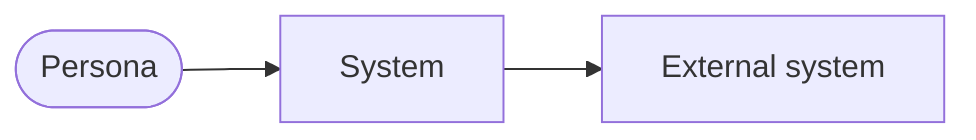
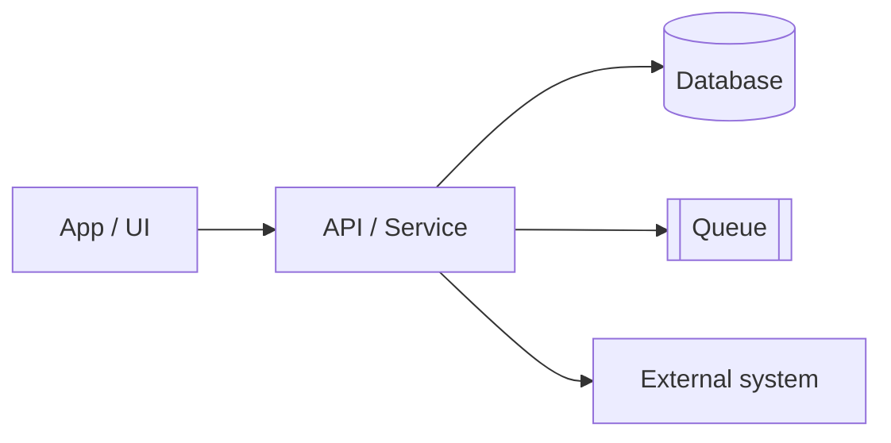
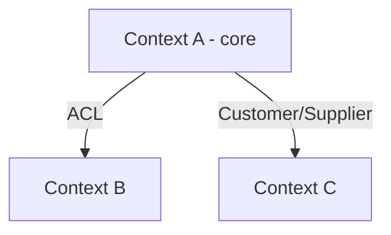

> **Translation note:** Originally authored in Portuguese (pt-BR) by Igor Uehara ([igoruehara/spec-driven](https://github.com/igoruehara/spec-driven), MIT). Translated to English by this hub to keep the repository language consistent. Original content unchanged in meaning; see the upstream repo for the pt-BR source.

# Architecture diagrams

> High level (C4 L1–L2 + bounded contexts map). Generated/updated by `/diagramar`.
> Renders on GitHub and in Claude Code. Keep in sync with `context-map.md` and the `design.md` files.
> Labels in the ubiquitous language from `glossary.md`.

## 1. System context (C4 L1)
> The system at the center, with personas and external systems. No internal detail.

## 2. Containers (C4 L2)
> The pieces that run (UI, services, data, queues) and how they talk.

## 3. Bounded contexts map (DDD)
> The system's contexts and the relationship pattern between them.

<!-- (optional) 4. Key flow: a critical journey as a sequenceDiagram. -->
